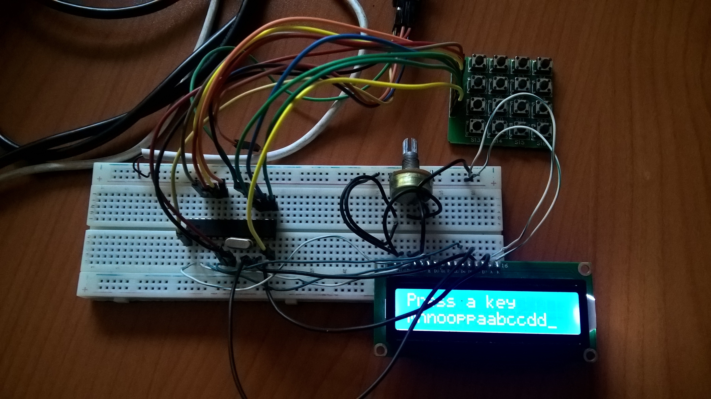

# Keyboard & Lcd Screen

This is a 4x4 keypad that displays letters on the lcd screen based on which key has been pressed. Built using an atmega328p, a 4x4 keypad, a resistor and lcd screen. The code runs on C. 

## Getting Started

Basic components required are:

1. Microcontroller (Atmega 328p-pu)
2. Crystal for timing operations (16Mhz crystal)
3. Lcd 1602A
4. Power source
5. Wires (male to female and male to male wires)
6. A programmer (usbtinyisp or any other)
7. Board (copper board or bread board)
8. Wires

Set up the circuit as shown in the figure below

<p align="center">
	
</p>

## Video Example

A video of the code running

<a href="http://www.youtube.com/watch?feature=player_embedded&v=nRCt9fh_DLI
" target="_blank"><p align="center"></p></a>

### Prerequisite

In this case I was using the terminal from linux

Install avr gcc by running the following command
```
sudo apt-get install gcc-avr binutils-avr avr-libc
```
Install avrdude by running
```
sudo apt-get install avrdude
```

### Installing

To upload the code to the chip, one can run these commands:

The following compiles the code to a .obj file
 ```
avr-gcc -g -Os -Wall -mcall-prologues -mmcu=atmega328p -fno-exceptions -o main.obj main.c
```    
The following code compiles the code to a .hex file
```
avr-objcopy -R .eeprom -O ihex main.obj main.hex
```
The following code uploads the .hex file to the chip (in this case I was using a usbtinyisp)
```
avrdude -b 19200 -c usbtiny -p m328p -U flash:w:main.hex para gravar no atmega
```

## References

This are the references I used  

1. Patrick Hood Daniel, using a 4x4 keypad https://www.youtube.com/watch?v=6FjrKXmquxU&t=898s

2. Avr Microcontroller and Embedded Systems The: Using Assembly and C
Book by Muhammad Ali Mazidi, Sarmad Naimi, and Sepehr Naimi

3. For the lcd screen http://www.avr-tutorials.com/projects/atmega16-avr-microcontroller-lcd-digital-clock